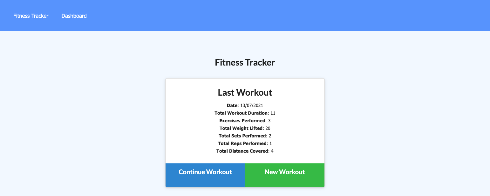
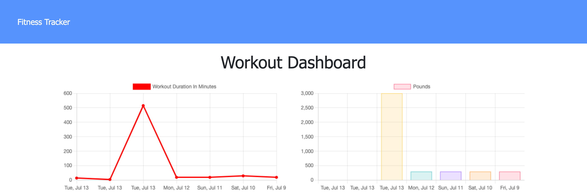

# Workout Tracker


## Description

This application allows users to view, create and track daily cardio and resistance workouts.

Users are able to log multiple exercises in a workout and also track the name, type, weight, sets, reps and duration of the exercise as well as duration, should it be cardio.

Users are able to view the combined weight of multiple exercise and total duration of each workout over the past 7 days

The following technologies were used to create this application

- Mongo DB
- Mongoose
- Heroku

## Table of Contents

- [Installation](#installation)
- [Usage](#usage)
- [Deployed Application](#deplyedApplication)
- [Resources](#resources)
- [Questions](#questions)

## Installation

```
npm install
```

## Usage

```
npm start
```

## Deployed Application

The deployed application can be viewed here: [Workout Tracker](https://protected-river-04016.herokuapp.com/?id=60ed03f030c34a4cdd545354)

When the user is first directed to the Workout Tracker they will see this image. Users can either create a new workout or continue their workout should they have one existing.  


Once users have entered their workout information they can view their stats on the stats page


## Resources

[Mongoose Aggregate Functions](https://mongoosejs.com/docs/api.html#aggregate_Aggregate)

[MongoDB $sum](https://docs.mongodb.com/manual/reference/operator/aggregation/sum/)

[MongoDB $addFields](https://docs.mongodb.com/manual/reference/operator/aggregation/addFields/)

## Questions

If you have any questions or would like to report and issue please contact me at my [GitHub](https://github.com/harmane4) or elise_harman@hotmail.com
